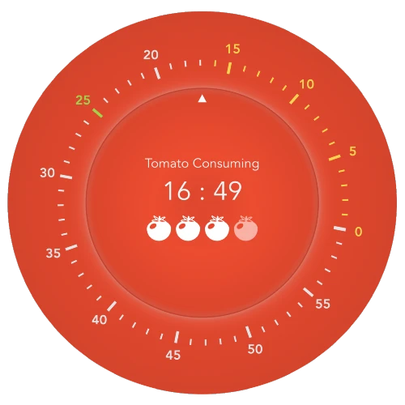

<h1 align="center">

</h1>

   

# Pomo

[Pomo](https://pomo.zhaozhao.today/) is an easy use PWA application, which implements the major features of the [Pomodoro Technique](https://en.wikipedia.org/wiki/Pomodoro_Technique) and can be used as a free countdown clock.

Compared with other similar pomodora applications, Pomo allows users to flexibly adjust the current time point while any 'tomato' or 'break' is running. That feature meets users' requirements of increasing or decreaing the running time as user need. Nevertheless, the clock-like plate around the center display simplifys the operations on adjusting time without using or callouting device keybord.

## Two modes

- Pomodoro: start a pomodoro cycle from tapping center display area.
- Countdown: rotate the clock-like plate to set a countdown and it starts automatically soon after the time is set.

---

# Tech Stack

- [Vue 3](https://v3.vuejs.org/)
- [Vite](https://vitejs.dev/)
- [Typescript](https://www.typescriptlang.org/)
- [Tailwind CSS](https://tailwindcss.com/): [Quick setup](https://tailwindcss.com/docs/guides/vue-3-vite) of Tailwind CSS + Vue3 + Vite.

# Contribution

## Commit

1. Fork it (<https://github.com/GloryWong/pomo.git>)
2. Create your feature branch (`git checkout -b feature/fooBar`)
3. Commit your changes (`git commit -am 'feat: Add some fooBar'`)
4. Push to the branch (`git push origin feature/fooBar`)
5. Create a new Pull Request

## Vue.js Devtools

The [Vue.js devtools](https://chrome.google.com/webstore/detail/vuejs-devtools/ljjemllljcmogpfapbkkighbhhppjdbg) is a completely new version for Vue 3.

## Recommended VSCode Setup

- [Volar](https://marketplace.visualstudio.com/items?itemName=johnsoncodehk.volar): You need to disable `Vetur` to avoid conflicts.
- [Tailwind CSS IntelliSense](https://marketplace.visualstudio.com/items?itemName=bradlc.vscode-tailwindcss)

## Note

This project mainly use the Vue3 feature `<script setup>`. To get proper IDE support for the syntax, use [Volar](https://marketplace.visualstudio.com/items?itemName=johnsoncodehk.volar) instead of Vetur (and disable Vetur).

## Q & A

- Q: Unknown `at rule` of `@tailwind`

  A: [Check here](https://stackoverflow.com/questions/47607602/how-to-add-a-tailwind-css-rule-to-css-checker)
